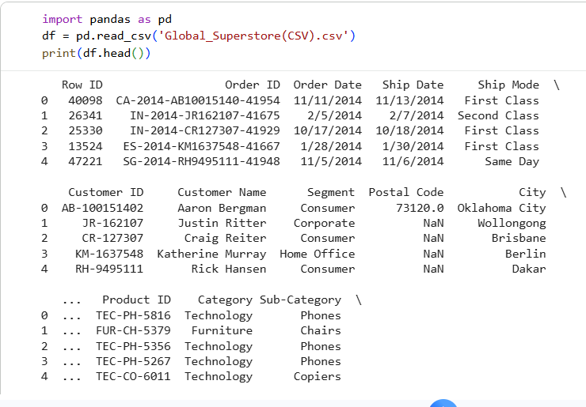
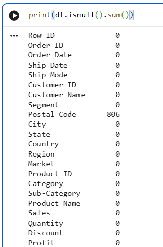
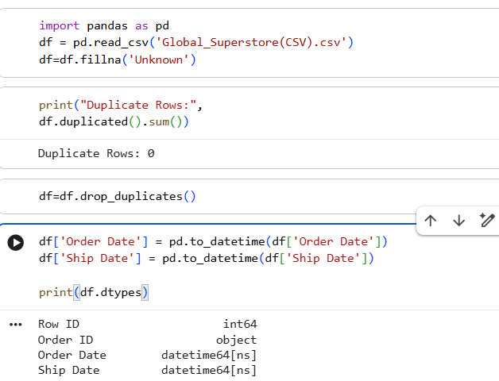
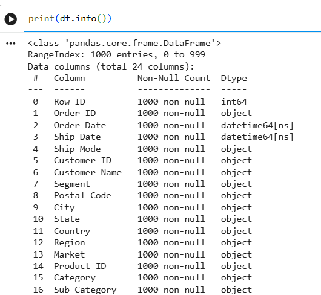
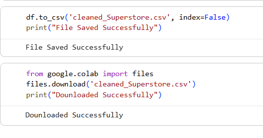

# SCT_DA_2

Task 2: Data Cleaning and Preparation

Objective

The objective of this task is to clean and prepare the dataset for analysis by identifying and handling missing values, removing duplicate records, and ensuring that all columns have appropriate data types.

Dataset Used

Global Superstore Dataset

1. Dataset Loading

The dataset was loaded into Google Colab using the Pandas library. The first few rows were examined to understand the structure of the dataset and its columns.

2. Missing Value Handling

The dataset was checked for missing values using Pandas functions. Missing values were identified and handled appropriately to improve data quality.

3. Duplicate Record Removal

Duplicate records were identified and removed from the dataset to ensure accuracy and consistency in future analysis.

4. Data Type Conversion

The data types of the dataset columns were verified and converted where necessary. This ensured that dates, numerical values, and text fields were stored in the correct format.

5. Data Validation and Final Output

After completing all cleaning operations, the dataset was validated to confirm that the changes were successfully applied. The cleaned dataset was then exported as a new CSV file.

Tools Used

- Python
- Pandas
- Google Colab
- GitHub

Files Included

- Global_Superstore.csv
- Cleaned_Superstore.csv
- Task2_Data_Cleaning.ipynb
- Project Screenshots
- README.md

Conclusion

The dataset was successfully cleaned and prepared for further analysis. Missing values were handled, duplicate records were removed, data types were verified, and the cleaned dataset was exported for future use in data analysis and visualization tasks.
